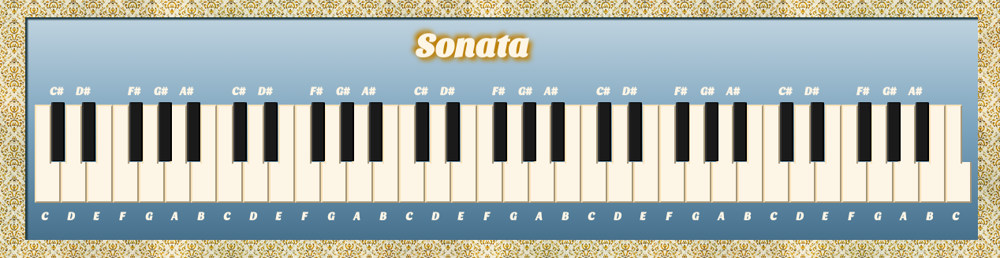

#Sonata

<a href="https://adrianaalter.github.io/Sonata/">Sonata</a> uses React components and the Tones.js web audio framework to create an interactive piano; each key on your computer keyboard will make a different note sound.  The piano is drawn in pure CSS, using pseudo-content, outset borders, box-shadows, and transitions.

</img>
